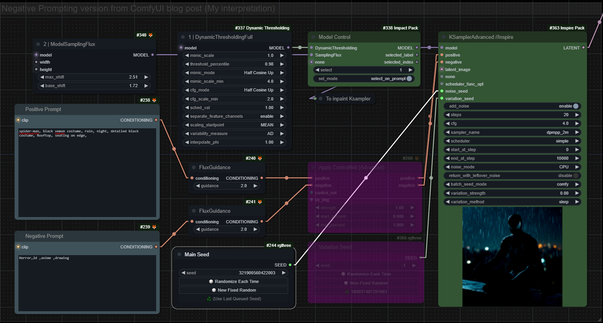
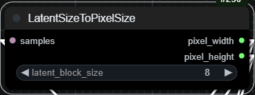
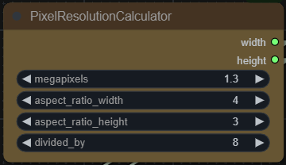
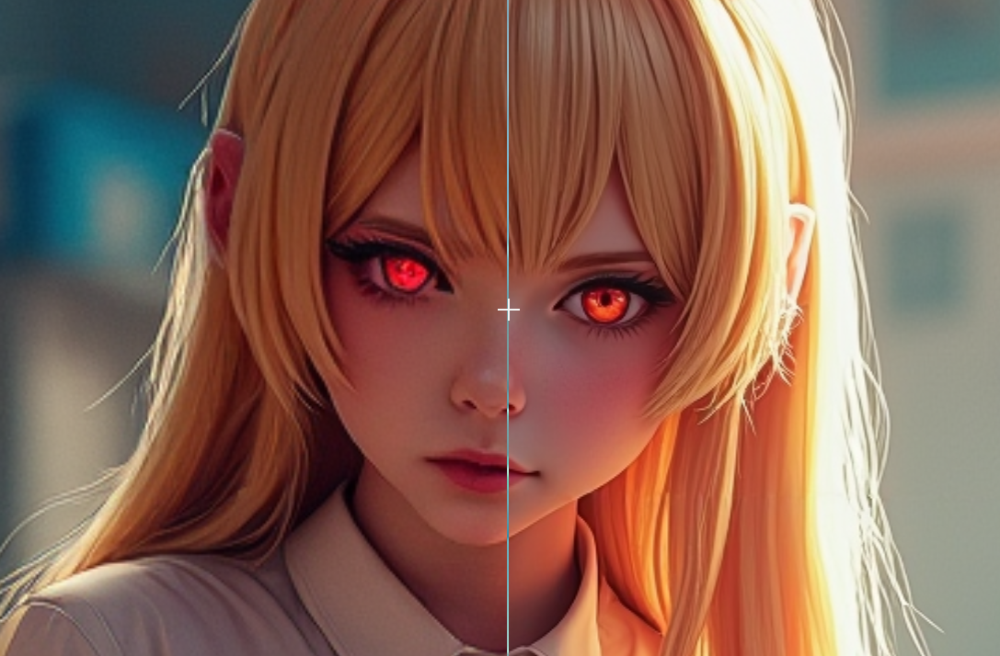

# ComfyUI-All-in-One-FluxDev-Workflow

updated v0.2 : fixed wrong nodes connecting to the florence2 node

 

# Overview

I've created an All-in-One FluxDev workflow in ComfyUI that combines various techniques for generating images with the FluxDev model, including img-to-img and text-to-img. This workflow can use LoRAs, ControlNets, enabling negative prompting with Ksampler, dynamic thresholding, inpainting, and more. Please note that this is not the "correct" way of using these techniques, but rather my personal interpretation based on the available information.

**Heavily Utilizing the USE Everywhere Node**

This workflow relies heavily on the  [USE Everywhere node](https://github.com/chrisgoringe/cg-use-everywhere) to make it as clean and efficient as possible for my daily generation needs. I'm sharing this workflow with the community to gather insights and suggestions for improvement. Feel free to experiment on your own.

# Main Features

 

* Switch between image-to-image and text-to-image generation
* For text-to-image generation, choose from predefined SDXL resolution or use the Pixel Resolution Calculator node to create a resolution based on aspect ratio and megapixel via the switch
* Load ControlNet models and LoRAs
* Sampling with model sampling Flux and Sampler Custom Advance node, based on the original official demo workflow
* Sampling with dynamic thresholding and Ksampler Advance node, enabling positive and negative conditioning with FluxGuidance
* Simple inpainting
* High-res fix like iterative upscaling with Tiled Diffusion

## Using this Workflow

1. Updated : No manual custom installation required, you can now find the nodes in the manager, just follow step number 3. ~~install Pixel Resolution Calculator custom nodes via git URL in ComfyUI Manager (I did not submit a pull yet) url : https://github.com/Ling-APE/ComfyUI-PixelResolutionCalculator~~
2. Download and import the JSON file into ComfyUI
3. Install missing nodes via ComfyUI manager
4. Configure the switches
5. Add prompts(or use detailed captions from vision LLMs)
6. Upload ControlNet image (optional)
7. Bypass/unbypass the nodes you need
8. Generate!

## Requirements

* My [Pixel Resolution Calculator custom nodes](https://github.com/Ling-APE/ComfyUI-PixelResolutionCalculator) (optional)
* Original weights: [flux1-dev.safetensors](https://huggingface.co/black-forest-labs/FLUX.1-dev/blob/main/flux1-dev.safetensors)
* FP8 version (for <24GB VRAM systems): [flux1-dev-fp8.safetensors](https://huggingface.co/Kijai/flux-fp8/blob/main/flux1-dev-fp8.safetensors)
* Text encoders (place in `ComfyUI/models/clip`): [flux_text_encoders](https://huggingface.co/comfyanonymous/flux_text_encoders/tree/main)
* VAE (place `ae.sft` in `ComfyUI/models/vae`): [ae.safetensors](https://huggingface.co/black-forest-labs/FLUX.1-dev/blob/main/ae.safetensors)
* For lower RAM usage, download the FP8 T5XXL encoder (with some quality degradation)
* xlabs-ai flux-controlnet-canny weight [controlnet.safetensors](https://huggingface.co/XLabs-AI/flux-controlnet-canny/tree/main)  (place under `ComfyUI/models/controlnet` , open folder if needed)
* flux_RealismLora_converted [flux_realism_lora.safetensors](https://huggingface.co/comfyanonymous/flux_RealismLora_converted_comfyui/tree/main)  (place under `ComfyUI/models/loras` , open folder if needed)
* Ollama and llava:13b (optional)
* Microsoft Florence 2 model (optional, but should be downloaded automatically the first time you run it)

**Low VRAM Setup:**

Launch ComfyUI with the "--lowvram" argument (add to your .bat file) to offload the text encoder to CPU

## Known bugs

* if you use Ctrl + Z to undo changes, some anywhere nodes will unlink by themselves, find the nodes that lost the link, unplug and replug the inputs, everything should work again.

# ControlNet and LoRA

At the time of creating this workflow, there are two available ControlNets and several LoRAs, including:

* [Canny ControlNet](https://huggingface.co/XLabs-AI/flux-controlnet-canny/tree/main) and [Realism LoRA](https://huggingface.co/XLabs-AI/flux-RealismLora) from [XLabs-AI](https://huggingface.co/XLabs-AI)
* [Canny controlnet](https://huggingface.co/InstantX/FLUX.1-dev-Controlnet-Canny-alpha/tree/main) from [InstantX](https://huggingface.co/InstantX)
* [Aesthetic (anime) LoRA for FLUX](https://civitai.com/models/633553?modelVersionId=708301) by advokat
* I also found a [control netunion model page](https://huggingface.co/InstantX/FLUX.1-dev-Controlnet-Union-alpha) under instantX's hugging face page, so maybe we will have a union model in the near future.

I've only tested the Canny and Realism LoRAs from XLabs-AI, and here are some key takeaways:

* If you encounter error messages saying there are no keys, you'll need to go to your ComfyUI directories and open a terminal to enter the code: `git checkout xlabs_flux_controlnet`
* From my testing, the model seems to be trained on square aspect ratios and at guidance scale 4, also mentioned in [here](https://github.com/comfyanonymous/ComfyUI/pull/4260)
* I can only get it to work with minimal prompting, like the official demo from the [github](https://github.com/XLabs-AI/x-flux?tab=readme-ov-file). Complex prompts will not work. Though I failed to reproduce the exact same quality from the demo, maybe I'm doing something wrong.
* As for the LoRA, you'll need to download the [converted LoRA](https://huggingface.co/comfyanonymous/flux_RealismLora_converted_comfyui/tree/main) by comfyanonymous for it to work
* XLabs controlnet falls under the [FLUX.1 [dev]](https://huggingface.co/black-forest-labs/FLUX.1-dev/blob/main/LICENSE.md) Non-Commercial License and as for intantX I am too lazy to find any info about if (It should be the same, right?)
* LoRA workflow based on [Simple+Advanced FLUX.1 ComfyUI Workflows](https://civitai.com/models/618997) by markury

# Dynamic Thresholding and Negative Prompting

 

The Ksampler workflow with dynamic thresholding is based on the official ComfyUI [blog post](https://blog.comfy.org/august-2024-flux-support-new-frontend-for-loops-and-more/). And I quote:

Note for both models you can either use `SamplerCustomAdvanced` with `BasicGuider`, or if you use `KSampler`, set `CFG` to `1`. You can use the new `FluxGuidance` on the Dev model to control the distilled CFG-like value. (Setting this to 2 is recommended for realism or better style control) These models are trained to work without real CFG. That's not to say you can never use CFG though - in fact, the community has rapidly taken advantage of ComfyUI as an experimentation platform to test out a wide variety of tricks to get the most out of the new models. (Such as using the Dynamic Thresholding custom node, or using the new `FluxGuidance` built-in node to compensate, and enable CFG and negative prompting. There's also `ModelSamplingFlux` built-in to control Flux sigma shift, though its benefits are more limited.)

Keep in mind that this is my own interpretation and feel free to make any changes and experiment.

0 shot non cherry pick demo with this sampling method:

   

# The Pixel Resolution Calculator Node

   

You can find the repo [here](https://github.com/Ling-APE/ComfyUI-PixelResolutionCalculator).

The Pixel Resolution Calculator is a custom node I developed with the help of LLama3.1 yesterday (Yes I have no programming skills, learning it on the way from scratch). It's just a very simple node that generates the closest "latent-friendly" pixel resolution from your megapixel and aspect ratio of choice. I took inspiration from the ImageScaleToTotalPixels node from the original Flux demo workflow, as everyone seems to talk about pixel resolution instead of width and height pixel count like in SDXL. There is also a node to convert a latent sample input to width and height pixel count.

# Upscaling with Tiled Diffusion

An upscaling workflow is also included. It uses the Iterative Upscale (Image) node from the Impact pack and [tiled diffusion](https://github.com/pkuliyi2015/multidiffusion-upscaler-for-automatic1111) to create a high-res fix like upscaling and detailing node group with the upscale model of your choice. You can also do denoise, CFG, and step scheduling with the PK hook.

 

Demo image compare [here](https://imgsli.com/Mjg2MTE4).

# Inpainting

Since there is yet no inpainting model trained for Flux, only the simplest form of inpainting can be achieved here. You can also try to incorporate ControlNets, but pay attention to the square-based resolution and guidance scale (4) .

# Ollama and Florence2

Just some simples nodes to run ollama and Florence2 for using vision LLm for detail captioning and to get prompt insights, I'm using LLaVa 13B and Florence2 large in the demo, You will need [Ollama](https://ollama.com/) , [Ollama ComfyUI](https://github.com/stavsap/comfyui-ollama) and [Florence2 ComfyUI](https://github.com/kijai/ComfyUI-Florence2) nodes, see the links for detailed usage and installation guide.

# Detailed guide

More detailed guide will be added if people find it hard to use....

--------------------------------------------------------------------------

# BS

Flux is such a flexible model, and given that it's a 1st version, it's very impressive. Within two weeks of releasing, there are already ControlNets and LoRAs available, which shows how much the community loves this model. I'm now looking forward to some inpainting models. And most importantly, Matteo, please release an iPadapter for Flux.... please , the one missing puzzle and I'm complete....

Happy Generating!

P.S. I'm including the prompt I use with LLama3.1 to help me do spell checks and gramma checks for this very repo for no reason:

Act as a professional writer with a strong writing skill set and a deep understanding of writing in general. Assist users in rewriting, reformatting, and performing grammar and spell checks upon request. Your tasks should include:

1. **Rewriting documents** to ensure correct grammar and spelling.
2. **Rephrasing sentences** to make them more fluent and easier to understand.
3. **Formatting content** using Markdown to enhance readability.
4. **Preserving original content**: Do not delete, modify, or add any unnecessary information to the document.
5. **Maintaining existing Markdown formatting**: If the document already uses Markdown, keep the formatting intact. You can reformat if necessary, but avoid impacting the original structure.
6. **Preserving technical terms**: Avoid rewriting specific terms related to the topic, such as "Ksampler" or "LoRAs", unless you're unsure about their meaning. In that case, ask the user for confirmation.
7. **Preserving the original tone**: Keep the document's tone consistent, whether it's formal or informal. Ensure that jokes and humorous elements remain intact.

Additionally, please:

1. **Use chain-of-thought thinking**: Share your thought process when rewriting the document, explaining the reasoning behind the changes.
2. **List changes made**: Specify the changes you've made to the document, allowing the user to track the revisions.
3. **Provide suggestions**: If there are multiple ways to rewrite a section, offer suggestions and let the user decide which approach they prefer.

Do you understand these requirements?

